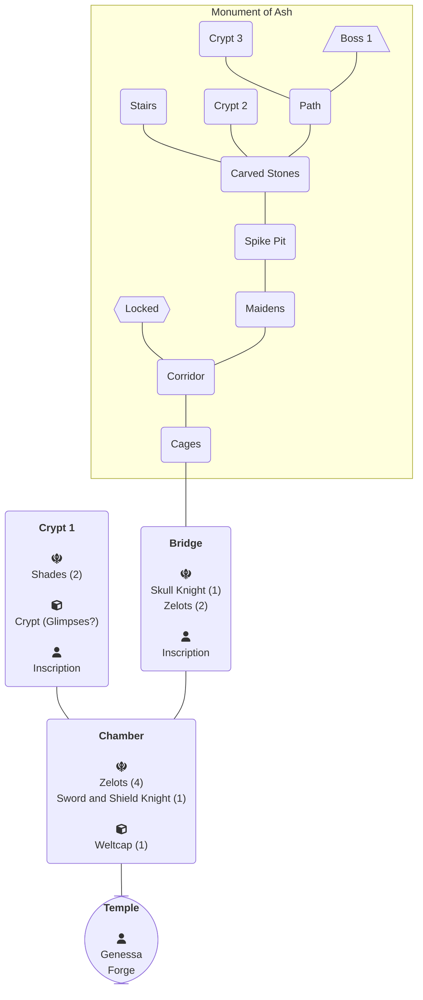

```mermaid
graph BT
  class A cssClass

  1(["
    <b>Temple</b>

    fa:fa-user 
    Genessa
    Forge
    "])
  2("
    <b>Chamber</b>

    fa:fa-khanda
    Zelots (4)
    Sword and Shield Knight (1)
    
    fa:fa-cube
    Weltcap (1)
    ")
  3("
    <b>Crypt 1</b>

    fa:fa-khanda
    Shades (2)

    fa:fa-cube
    Crypt (Glimpses?)
    
    fa:fa-user
    Inscription
    ")
  4("
    <b>Bridge</b>
    
    fa:fa-khanda
    Skull Knight (1)
    Zelots (2)

    fa:fa-user
    Inscription
    ")
  5(Cages)
  6(Corridor)
  7{{Locked}}
  8(Maidens)
  9(Spike Pit)
  10(Carved Stones)
  11(Stairs)
  12(Crypt 2)
  13(Path)
  14(Crypt 3)
  15[/Boss 1\]

  1 --- 2
  2 --- 3
  2 --- 4
  4 --- 5
  subgraph "Monument of Ash"
    5 --- 6
    6 --- 7
    6 --- 8
    8 --- 9
    9 --- 10
    10 --- 12
    10 --- 11
    10 --- 13
    13 --- 14
    13 --- 15
  end

```